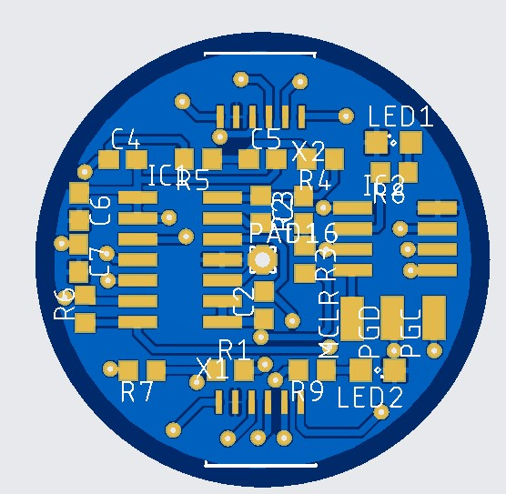
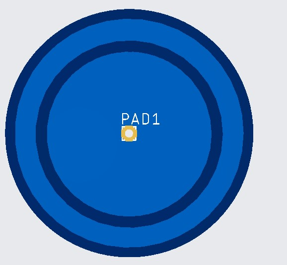
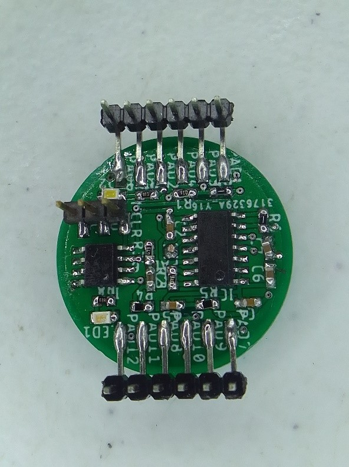
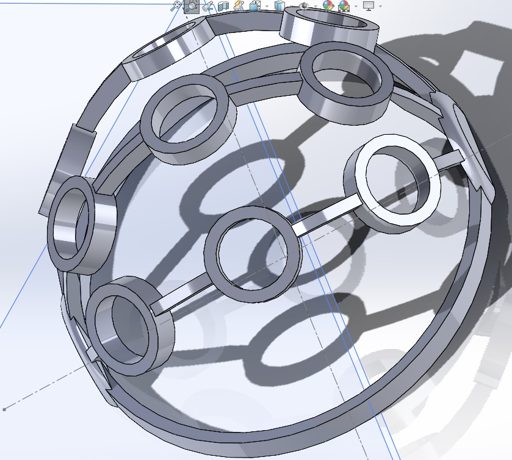
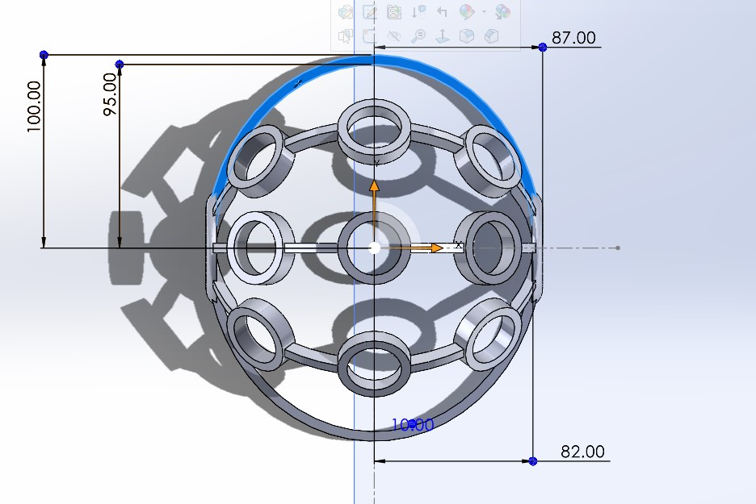
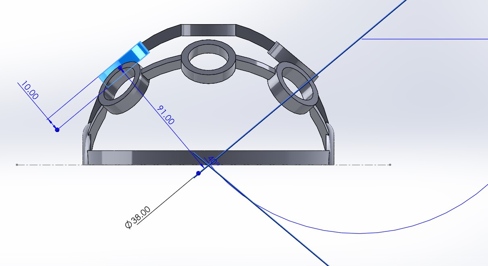
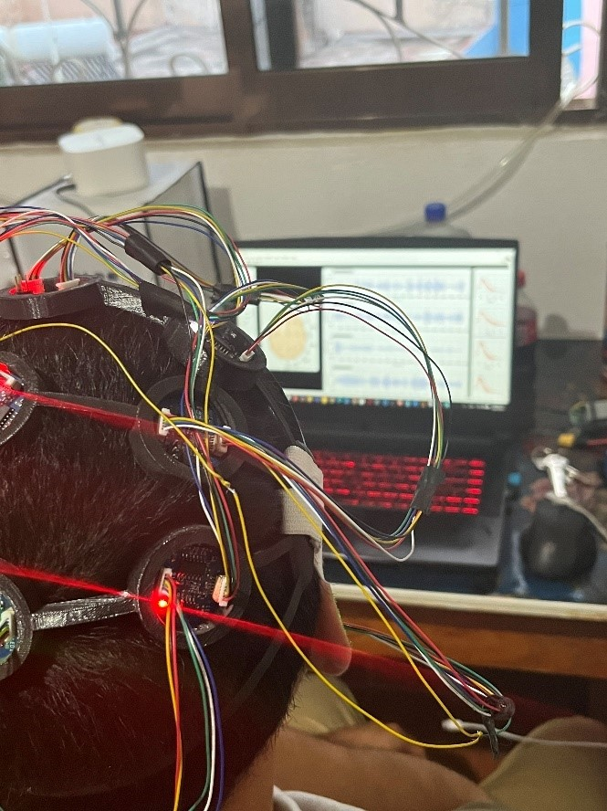
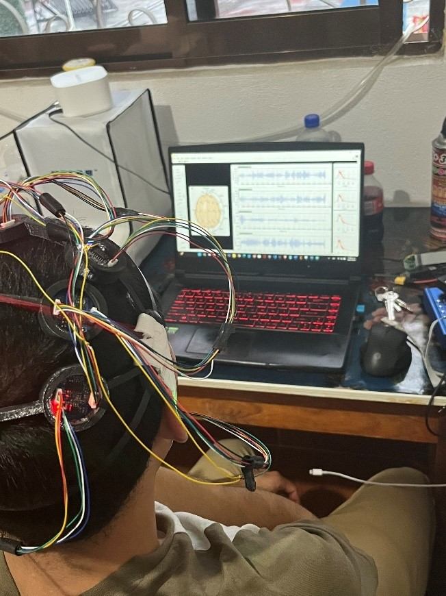
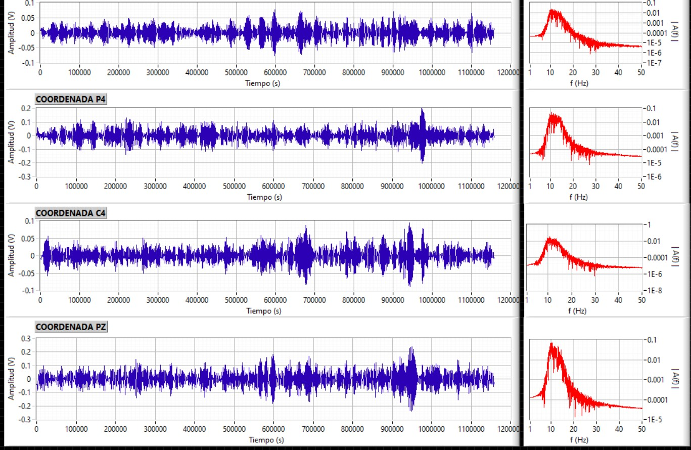

# EEG con Sensores Capacitivos de No Contacto

## 🧠 Descripción

Este proyecto consiste en el desarrollo de un prototipo para la adquisición de señales electroencefalográficas (EEG) utilizando sensores capacitivos de no contacto. El sistema incluye una interfaz gráfica desarrollada en LabVIEW que permite visualizar y guardar los datos adquiridos.

El propósito principal es contar con una alternativa no invasiva y cómoda para el monitoreo de actividad cerebral, útil para investigación biomédica y futuros desarrollos en interfaces cerebro-computadora.

## 🔧 Tecnologías utilizadas

- **Lenguaje C** – Programación de microcontroladores.
- **Arduino** – Pruebas iniciales y prototipado.
- **MPLAB X IDE** – Desarrollo en microcontroladores PIC.
- **LabVIEW** – Interfaz gráfica para visualización y almacenamiento de señales.
- **SolidWorks** – Diseño del headset 3D.
- **Autodesk EAGLE** – Diseño de las placas electrónicas.

## 🖼️ Capturas

### Placa electrónica del electrodo en 3D Vista superior

### Placa electrónica del electrodo en 3D Vista inferior

### Placa electrónica del electrodo fabricada

### Headset impreso en 3D

## Pruebas realizadas

### Interfaz de LabVIEW

## 🚀 Instrucciones básicas de uso

1. **Conecta el sistema**: Alimenta los sensores y conecta el microcontrolador al PC.
2. **Ejecuta la interfaz LabVIEW**: Abre el archivo del proyecto y configura el puerto de comunicación.
3. **Adquiere señales**: Visualiza en tiempo real y guarda los datos cuando sea necesario.
4. **Exporta**: Los datos pueden exportarse como archivo `.csv` para análisis posterior.

## 🤝 Contribuciones

Este proyecto es parte de una tesis de ingeniería, pero estás invitado a contribuir con mejoras, sugerencias o ideas. Abre un Issue o un Pull Request si deseas colaborar.

## 🧾 Licencia

Este proyecto no tiene una licencia formal asignada. Si deseas usarlo con fines educativos o de investigación, puedes hacerlo con atribución.

## 👤 Autor

Michell Alejandro López Sierra  
[GitHub](https://github.com/) | [LinkedIn](https://linkedin.com/) | [Email](ingmichell5101@gmail.com)

